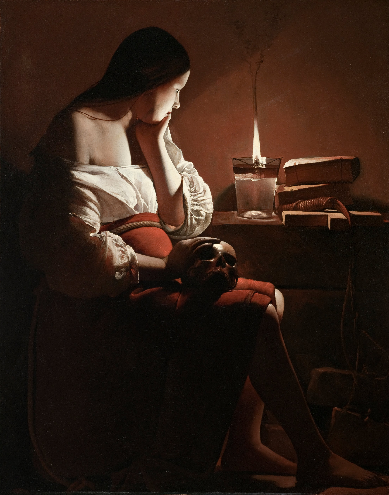

# AutoCrypt
Src contient les scripts d'automatisation de divers algorithmes symétriques classiques (AES, Camellia, SM4, 3DES, Blowfish, CAST5) et deux symétriques dit  en "cascade" (Franck, Lucie) en s'appuyant sur KeepassXC (MacOS) pour la gestion des clés générées à chaque passage. Src contient également l'automatisation d'algorithmes de chiffrements asymétriques (RSA).

On ne code pas dans l'espoir de succès, Non ! C'est bien plus beau lorsque c'est inutile ! 

(Inspiré de Cyrano de Bergerac d'Edmond Rostand) 
