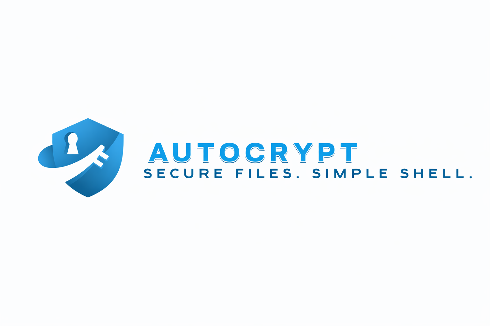

<p align="center">
  
</p>

<p align="center">
  
  
  
</p>

# AutoCrypt

AutoCrypt is a **POSIX-compliant shell script** designed to **securely encrypt, decrypt, and irreversibly erase files** using strong cryptography and multiple authentication factors.

It combines:
- **OpenSSL** for robust file encryption
- **KeePassXC CLI** for secure password generation and storage
- Optional **hardware-backed secrets** (e.g. YubiKey)

The core idea is to **turn digital risk into physical risk**:  
if *any* authentication factor is missing, **decryption becomes impossible**.

## ✨ Features

- 🔐 Configurable multi-pass encryption
- 🔑 Secure password generation via KeePassXC
- 🧠 Multiple authentication factors (passwords, files, hardware)
- 🧹 Secure erase via encryption-based overwrite
- 📦 Fully POSIX-compliant (`/bin/sh`)
- 🐧 Designed for Unix-like systems  
  *(tested on Tails OS and macOS)*


## 🔧 Installation

Download the `autocrypt.sh` script, then edit the **setup section** inside the file:

```sh
#====================== SET UP ======================#

readonly KEYFILEPATH="your_key_file_path"
readonly YUBIKEY="slot:serial"
readonly DBPATH="your_database_path"
readonly DBPWRD="your_database_password"
N=3
````

Make the script executable:

```sh
chmod u+x autocrypt.sh
```

## 👨🏻‍💻 Usage

Display help:

```sh
./autocrypt.sh -h
```

> ⚠️ Note: **do not source the script** (`. ./autocrypt.sh`).

```
Usage :

autocrypt [mode] [algorithm] file1 file2 ...

Mode :

	-e : encrypt mode
	-d : decrypt mode
	-s : secure erase
	-h : show help

Cipher algorithm :

	-aes-128-cbc               -aes-128-cfb               -aes-128-cfb1
	-aes-128-cfb8              -aes-128-ctr               -aes-128-ecb
	-aes-128-ofb               -aes-192-cbc               -aes-192-cfb
	-aes-192-cfb1              -aes-192-cfb8              -aes-192-ctr
	-aes-192-ecb               -aes-192-ofb               -aes-256-cbc
	-aes-256-cfb               -aes-256-cfb1              -aes-256-cfb8
	-aes-256-ctr               -aes-256-ecb               -aes-256-ofb
	-aes128                    -aes128-wrap               -aes128-wrap-pad
	-aes192                    -aes192-wrap               -aes192-wrap-pad
	-aes256                    -aes256-wrap               -aes256-wrap-pad
	-id-aes128-wrap            -id-aes128-wrap-pad        -id-aes192-wrap
	-id-aes192-wrap-pad        -id-aes256-wrap            -id-aes256-wrap-pad
	-aria-128-cbc              -aria-128-cfb              -aria-128-cfb1
	-aria-128-cfb8             -aria-128-ctr              -aria-128-ecb
	-aria-128-ofb              -aria-192-cbc              -aria-192-cfb
	-aria-192-cfb1             -aria-192-cfb8             -aria-192-ctr
	-aria-192-ecb              -aria-192-ofb              -aria-256-cbc
	-aria-256-cfb              -aria-256-cfb1             -aria-256-cfb8
	-aria-256-ctr              -aria-256-ecb              -aria-256-ofb
	-aria128                   -aria192                   -aria256
	-camellia-128-cbc          -camellia-128-cfb          -camellia-128-cfb1
	-camellia-128-cfb8         -camellia-128-ctr          -camellia-128-ecb
	-camellia-128-ofb          -camellia-192-cbc          -camellia-192-cfb
	-camellia-192-cfb1         -camellia-192-cfb8         -camellia-192-ctr
	-camellia-192-ecb          -camellia-192-ofb          -camellia-256-cbc
	-camellia-256-cfb          -camellia-256-cfb1         -camellia-256-cfb8
	-camellia-256-ctr          -camellia-256-ecb          -camellia-256-ofb
	-camellia128               -camellia192               -camellia256

Order of options matters.
```

## 🧪 Example

Suppose you have a file and want to **automatically encrypt it 3 times** (configurable) using AES.

```sh
mathis ~ $ cat hello.txt
Hello World !
```

After installing `autocrypt.sh`, plugging in your **YubiKey**, your **KeePassXC database**, and your **keyfile**, configure the script and make it executable.

Encrypt the file:

```sh
mathis ~ $ ./autocrypt.sh -e -aes-256-cbc hello.txt
```

If the script is located in `~/Desktop` and your terminal is in `~`, use:

```sh
./Desktop/autocrypt.sh -e -aes-256-cbc hello.txt
```

### Encryption output

```sh
Enter password to unlock KeePass database:
1 encryption done
Enter password to unlock KeePass database:
2 encryption done
Enter password to unlock KeePass database:
3 encryption done
```

Trying to read the file now:

```sh
mathis ~ $ cat hello.txt
Salted__...binary encrypted data...
```

### Decryption

```sh
mathis ~ $ ./autocrypt.sh -d -aes-256-cbc hello.txt
```

Decryption output:

```sh
Enter password to unlock KeePass database:
Decryption 3 done
Enter password to unlock KeePass database:
Decryption 2 done
Enter password to unlock KeePass database:
Decryption 1 done
```

File restored:

```sh
mathis ~ $ cat hello.txt
Hello World !
```

## 📦 Dependencies

AutoCrypt relies on the following tools:

| Tool            | Purpose                       |
| --------------- | ----------------------------- |
| `sh` (POSIX)    | Script execution              |
| `openssl`       | Encryption / Decryption       |
| `keepassxc-cli` | Password generation & storage |
| `dd`            | Secure overwrite              |
| `rm`            | File removal                  |
| `uname`         | OS detection                  |

Ensure all dependencies are available in your `$PATH`.


## ⚠️ Disclaimer

AutoCrypt is designed for **advanced users**.
Losing encryption credentials will result in **permanent data loss**.


