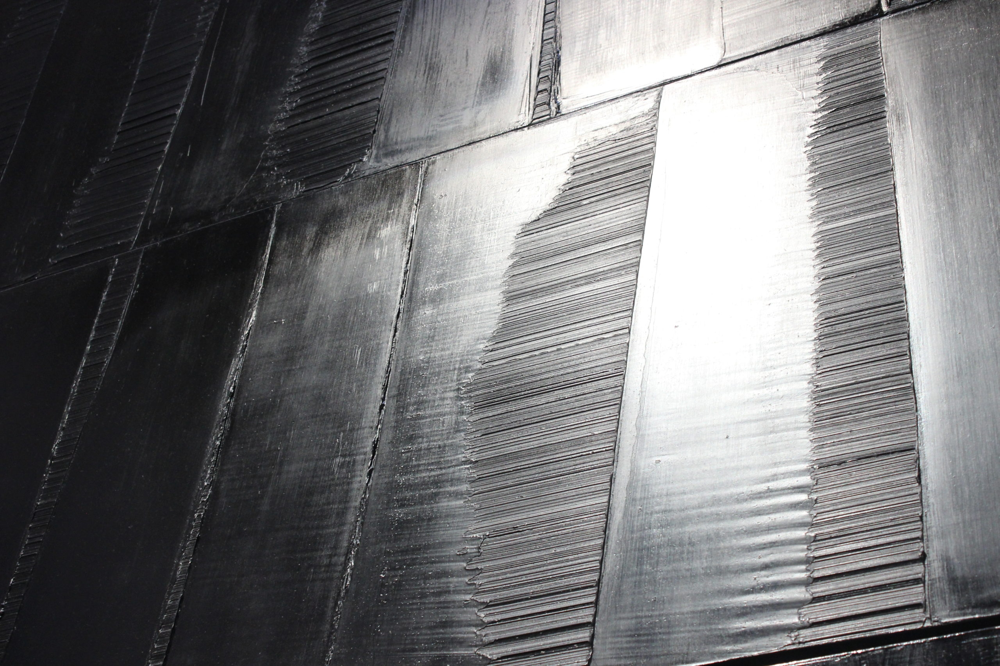

# AutoCrypt
Src contient les scripts d'automatisation de divers algorithmes classiques (AES, Camellia, SM4, 3DES, Blowfish, CAST5) et deux algorithmes de chiffrement en cascade (Franck, Lucie) en s'appuyant sur KeepassXC pour la gestion des clés générées à chaque passage. (MacOS)



## Installation
Pré-requis
```zsh
brew install KeepassXC && brew install openssl@3 
```
Créer une base de donné avec : un mot de passe fort, une Yubikey et un fichier clé.
Changer les variables Set-up du script utilisé (pour le déchiffrement aussi).
```zsh
##########
# Set Up #
##########

KEYFILEPATH=<Key_File_path>
YUBIKEY=<slot[:serial]>
DBPATH=<DataBase_path>
```
Rendre éxécutable le script
```zsh
chmod u+x <AutoCrypt.sh_path>
``` 
## Usage
Lancer le script voulu dans un terminal :
```zsh
Quel est le chemin du fichier à chiffrer ?
~/Desktop/Hello.txt  
Combien de fois voulez-vous le chiffrer ? 
3
Quel est le mot de passe de la database ? 
```
Entrer le mot de passe de la database, et voilà !

Pour le déchiffrement, lancer le script de déchiffrement indiqué par le R, type : FranckR.sh
